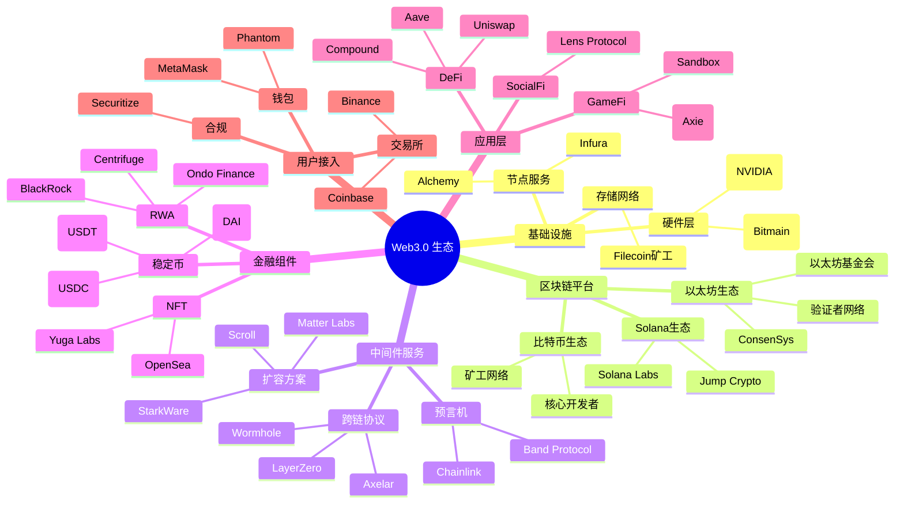
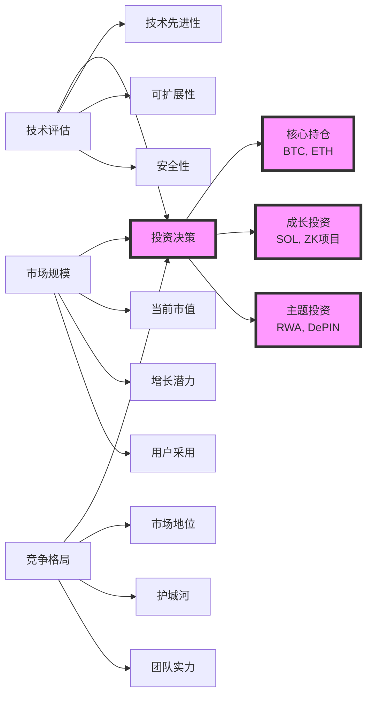

# Web3.0 生态业务架构 - 麦肯锡风格专业架构图

## 架构概览

```mermaid
graph TB
    %% 样式定义
    classDef l0Style fill:#1e3a8a,stroke:#1e40af,stroke-width:3px,color:#fff
    classDef l1Style fill:#059669,stroke:#10b981,stroke-width:3px,color:#fff
    classDef l2Style fill:#dc2626,stroke:#ef4444,stroke-width:3px,color:#fff
    classDef l3Style fill:#7c2d12,stroke:#ea580c,stroke-width:3px,color:#fff
    classDef l4Style fill:#581c87,stroke:#8b5cf6,stroke-width:3px,color:#fff
    classDef l5Style fill:#be185d,stroke:#ec4899,stroke-width:3px,color:#fff
    classDef coretech fill:#fbbf24,stroke:#f59e0b,stroke-width:4px,color:#000
    classDef keyplayer fill:#6b7280,stroke:#4b5563,stroke-width:2px,color:#fff

    %% L5: 接入层
    subgraph L5 ["🚪 L5: 接入层 (Access Layer)<br/>用户与Web3交互的合规入口"]
        L5A[🔐 钱包<br/>MetaMask, Phantom, Ledger]
        L5B[📋 合规网关<br/>Securitize, Coinbase]
        L5C[🌐 DApp浏览器]
    end

    %% L4: 场景层
    subgraph L4 ["🎯 L4: 场景层 (Scene Layer)<br/>落地应用"]
        L4A[💰 DeFi<br/>Uniswap, Aave, Compound]
        L4B[🎮 GameFi/元宇宙<br/>Axie Infinity, Sandbox]
        L4C[👥 SocialFi<br/>Lens Protocol]
        L4D[🏗️ DePIN<br/>Helium Network]
    end

    %% L3: 组件层
    subgraph L3 ["🧩 L3: 组件层 (Component Layer)<br/>封装金融协议与开发者工具"]
        L3A[💵 稳定币 ⭐<br/>USDC, USDT, DAI]
        L3B[🏢 RWA ⭐<br/>BlackRock BUIDL, Ondo Finance]
        L3C[🎨 NFT<br/>OpenSea, Yuga Labs]
        L3D[🔧 DeFi协议原语<br/>Uniswap, Aave]
    end

    %% L2: 中间件层
    subgraph L2 ["⚙️ L2: 中间件层 (Middleware Layer)<br/>扩展性能、跨链互通、链下数据接入"]
        L2A[🔒 零知识证明 ⭐<br/>StarkWare, zkSync, Scroll]
        L2B[🌉 跨链技术 ⭐<br/>LayerZero, Wormhole, Chainlink CCIP]
        L2C[🔮 预言机 ⭐<br/>Chainlink (领导者), Band Protocol]
    end

    %% L1: 区块链层
    subgraph L1 ["⛓️ L1: 区块链层 (Blockchain Layer)<br/>价值结算与智能合约执行"]
        L1A[🏛️ 以太坊 ⭐<br/>ETH, PoS共识<br/>全球结算层]
        L1B[⚡ Solana ⭐<br/>SOL, PoH+PoS<br/>65,000 TPS]
        L1C[💎 比特币 ⭐<br/>BTC, PoW<br/>数字黄金]
        L1D[🧮 哈希算法 ⭐<br/>SHA-256<br/>数据不可篡改]
    end

    %% L0: 物理设施层
    subgraph L0 ["🏗️ L0: 物理设施层 (Physical Infrastructure)<br/>提供分布式网络基础资源"]
        L0A[🌐 P2P网络 ⭐<br/>去中心化通信协议]
        L0B[💾 去中心化存储<br/>IPFS, Filecoin]
        L0C[🏭 硬件制造商<br/>Bitmain, NVIDIA]
        L0D[🖥️ 节点运营商<br/>Infura, Alchemy]
    end

    %% 层级关系
    L5 --> L4
    L4 --> L3
    L3 --> L2
    L2 --> L1
    L1 --> L0

    %% 应用样式
    class L5A,L5B,L5C l5Style
    class L4A,L4B,L4C,L4D l4Style
    class L3A,L3B,L3C,L3D l3Style
    class L2A,L2B,L2C l2Style
    class L1A,L1B,L1C,L1D l1Style
    class L0A,L0B,L0C,L0D l0Style
```

## 核心技术重要性分析

```mermaid
quadrantChart
    title Web3.0 核心技术重要性矩阵
    x-axis 技术先进性 --> 高
    y-axis 市场采用度 --> 高
    
    quadrant-1 明星技术 (持续投资)
    quadrant-2 现金牛 (维持领先)
    quadrant-3 问题技术 (谨慎观察)
    quadrant-4 新兴技术 (战略布局)

    零知识证明: [0.9, 0.6]
    以太坊: [0.7, 0.9]
    比特币: [0.5, 0.9]
    Solana: [0.8, 0.7]
    跨链技术: [0.8, 0.5]
    预言机: [0.6, 0.8]
    稳定币: [0.4, 0.9]
    RWA: [0.7, 0.4]
    哈希算法: [0.5, 1.0]
    P2P网络: [0.4, 1.0]
```

## 市场主体生态地图



## 技术发展趋势预测

```mermaid
gantt
    title Web3.0 关键技术发展路线图
    dateFormat  YYYY-MM-DD
    section 基础设施
    P2P网络优化           :done, p2p, 2020-01-01, 2024-12-31
    去中心化存储扩展      :active, storage, 2023-01-01, 2026-12-31
    
    section 区块链层
    以太坊2.0完成         :done, eth2, 2022-09-15, 2022-09-15
    Solana性能优化        :active, sol, 2023-01-01, 2025-12-31
    新一代公链崛起        :future, newchain, 2025-01-01, 2027-12-31
    
    section 扩容技术
    Optimistic Rollups    :done, op, 2021-01-01, 2024-12-31
    ZK-Rollups主流化      :active, zk, 2023-01-01, 2026-12-31
    zkEVM完善             :active, zkevm, 2024-01-01, 2026-12-31
    
    section 跨链互操作
    基础跨链桥            :done, bridge1, 2021-01-01, 2024-12-31
    通用消息传递          :active, bridge2, 2023-01-01, 2025-12-31
    原生互操作性          :future, native, 2025-01-01, 2027-12-31
    
    section 应用创新
    DeFi 1.0              :done, defi1, 2020-01-01, 2022-12-31
    DeFi 2.0 & RWA        :active, defi2, 2023-01-01, 2025-12-31
    大规模应用采用        :future, mass, 2025-01-01, 2028-12-31
```

## 投资价值评估框架



---

**编辑说明：**
1. 本图使用Mermaid语法，可在支持Mermaid的编辑器中查看和编辑
2. 标有⭐的为核心关键技术
3. 各层级按重要性和技术先进性排序
4. 可通过修改classDef调整颜色主题
5. 支持导出为PNG、SVG等格式