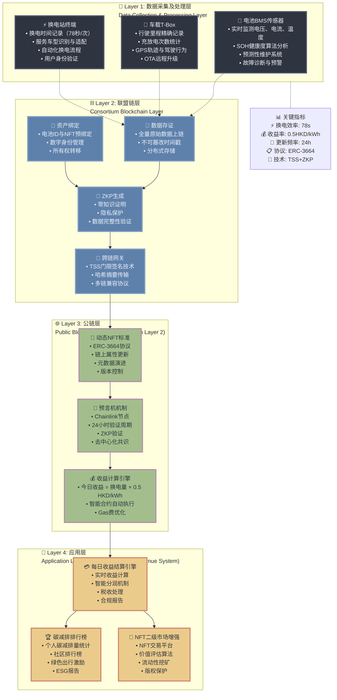

# 电池NFT四层架构图

## Mermaid 流程图

## 系统详细说明

### 🔧 Layer 1: 数据采集及处理层
**目标**: 物理世界→数字映射

- **电池BMS传感器**: 实时监测电池核心参数，构建数字化电池画像
- **车载T-Box**: 记录车辆使用数据，提供驾驶行为分析
- **换电站终端**: 精准记录换电服务数据，确保78秒高效换电

### ⛓️ Layer 2: 联盟链层  
**目标**: 数据可信存储与隐私保护

- **数据存证**: 确保所有原始数据不可篡改，建立信任基础
- **资产绑定**: 将物理电池与数字NFT建立唯一映射关系
- **ZKP生成**: 保护用户隐私同时验证数据真实性
- **跨链网关**: 使用TSS技术安全传输数据到公链

### 🌐 Layer 3: 公链层
**目标**: 去中心化NFT管理与收益分配

- **动态NFT标准**: 采用ERC-3664协议，支持属性动态更新
- **预言机机制**: Chainlink提供可靠的外部数据验证
- **收益计算引擎**: 透明的收益分配算法，0.5 HKD/kWh

### 📱 Layer 4: 应用层
**目标**: 用户体验与价值实现

- **每日收益结算引擎**: 自动化收益计算与分配
- **碳减排排行榜**: 激励绿色出行，构建ESG生态
- **NFT二级市场**: 提供流动性，实现价值流转

## 技术亮点

1. **高效换电**: 78秒标准化换电流程
2. **隐私保护**: ZKP+TSS双重保护机制  
3. **动态更新**: ERC-3664支持NFT属性实时更新
4. **透明收益**: 基于实际换电量的公平分配机制
5. **绿色激励**: 碳减排量化与社区激励机制