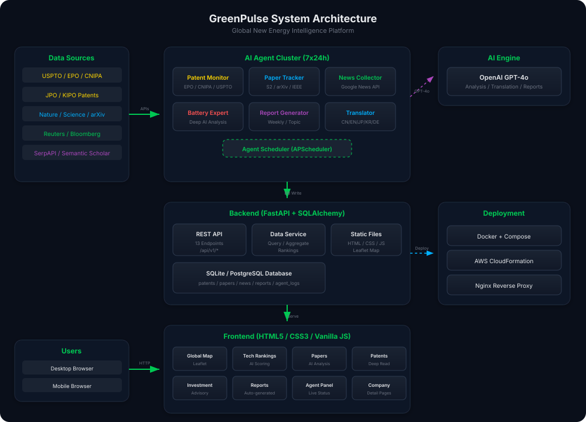

# GreenPulse 商业需求文档 (BRD)

**文档版本**: v1.0  
**编写日期**: 2026-02-25  
**项目名称**: GreenPulse - 全球新能源情报平台  
**文档状态**: 已批准

---

## 1. 执行摘要

GreenPulse 是一个基于 AI 智能体的全球新能源情报监控与分析平台。平台通过 6 个 AI 智能体 7×24 小时不间断监控全球新能源领域的专利申请、学术论文和产业新闻，特别聚焦电池技术领域，为企业决策者、投资机构和研究人员提供实时、深度的行业情报服务。



---

## 2. 商业背景

### 2.1 市场机遇

全球新能源产业正处于爆发式增长阶段：

| 指标 | 2024年 | 2026年(预测) | 增长率 |
|------|--------|-------------|--------|
| 全球动力电池市场规模 | $120B | $180B | 50% |
| 新能源相关专利年申请量 | 85,000 | 128,000+ | 51% |
| 新能源领域论文年发表量 | 42,000 | 57,000+ | 36% |
| 新能源行业投资额 | $495B | $680B | 37% |

### 2.2 痛点分析

当前新能源行业情报获取面临以下核心痛点：

1. **信息碎片化**: 专利分布在 USPTO、EPO、CNIPA、JPO、KIPO 等多个专利局，论文散布在数百种期刊
2. **语言壁垒**: 中、英、日、韩、德多语言内容难以统一处理
3. **时效性差**: 传统行业报告发布周期长达数月，无法满足快节奏决策需求
4. **分析深度不足**: 海量信息缺乏深度的技术解读和产业影响评估
5. **缺乏投资视角**: 技术动态与投资决策之间缺少桥梁

### 2.3 竞争分析

| 竞品 | 覆盖范围 | AI分析 | 实时性 | 专利+论文 | 投资建议 |
|------|---------|--------|--------|----------|---------|
| Bloomberg NEF | 广 | 有限 | 日更 | 仅新闻 | 有 |
| PatSnap | 专利 | 有 | 周更 | 仅专利 | 无 |
| Dimensions | 论文 | 有限 | 日更 | 仅论文 | 无 |
| **GreenPulse** | **全面** | **深度AI** | **实时** | **全覆盖** | **有** |

---

## 3. 商业目标

### 3.1 短期目标 (0-6个月)

- 完成平台 MVP 版本开发和部署
- 实现 6 个 AI 智能体的自动化运行
- 覆盖 47 个国家的新能源情报监控
- 积累 12万+ 专利、5万+ 论文的数据库

### 3.2 中期目标 (6-18个月)

- 用户注册数达到 5,000+
- 付费订阅用户 500+
- 周活跃用户率 > 60%
- 建立行业影响力，被 3+ 主流媒体报道

### 3.3 长期目标 (18-36个月)

- 成为新能源领域 Top 3 情报平台
- 年营收 $5M+
- 拓展至储能、氢能、碳中和等相邻领域
- 推出企业级 API 服务

---

## 4. 目标用户画像

### 4.1 企业研发决策者

- **角色**: CTO、研发副总裁、技术总监
- **需求**: 追踪竞争对手专利布局、前沿技术动态
- **使用场景**: 每日查看全球动态地图、阅读核心论文/专利解读
- **付费意愿**: 高 ($2,000-5,000/年)

### 4.2 投资分析师

- **角色**: PE/VC投资经理、行业分析师
- **需求**: 发现投资机会、评估技术成熟度
- **使用场景**: 查看投资建议报告、企业详情分析
- **付费意愿**: 高 ($3,000-10,000/年)

### 4.3 学术研究人员

- **角色**: 教授、博士生、研究员
- **需求**: 追踪最新论文、了解技术趋势
- **使用场景**: 核心论文研读、技术排名参考
- **付费意愿**: 中 ($200-500/年)

### 4.4 政策制定者

- **角色**: 政府产业政策部门官员
- **需求**: 了解全球技术布局和竞争格局
- **使用场景**: 产业布局报告、全球地图视图
- **付费意愿**: 机构采购 ($10,000-50,000/年)

---

## 5. 核心功能需求

### 5.1 全球动态地图 (P0)

基于真实世界地图的每日情报可视化，展示专利、论文、新闻在全球的分布和热度。

```
用户价值: 一目了然地了解全球新能源活动热点
商业价值: 平台差异化核心功能，高视觉冲击力
```

### 5.2 前沿技术排名 (P0)

多维度 AI 评分的技术和企业排名，覆盖电池、太阳能、氢能、风能、储能、电动汽车六大领域。

```
用户价值: 快速把握技术发展趋势和竞争格局
商业价值: 高频访问，提升用户粘性
```

### 5.3 核心论文/专利研读 (P0)

AI 自动筛选高影响力论文和核心专利，生成深度解读报告。

```
用户价值: 节省大量文献阅读时间，获取专业级分析
商业价值: 核心付费功能，高附加值
```

### 5.4 企业详情分析 (P0)

全景式企业分析页面，包含财务、技术、专利、投资评级等维度。

```
用户价值: 全面了解目标企业的新能源布局
商业价值: 支撑投资决策，高价值功能
```

### 5.5 投资建议 (P1)

基于 AI 情报分析的投资机会评估和建议报告。

```
用户价值: 发现投资机会，量化风险和潜力
商业价值: 高端付费功能，差异化优势
```

### 5.6 产业布局报告 (P1)

AI 自动生成的周度/月度深度行业分析报告。

```
用户价值: 获取系统化的产业分析
商业价值: 可作为独立付费产品销售
```

### 5.7 AI 智能体监控面板 (P2)

实时展示 6 个 AI 智能体的运行状态和数据采集统计。

```
用户价值: 透明展示平台数据来源和实时性
商业价值: 增强用户信任，提升品牌形象
```

---

## 6. 商业模式

### 6.1 收入来源

| 收入类型 | 描述 | 预期占比 |
|---------|------|---------|
| SaaS订阅 | 个人/企业年度订阅 | 50% |
| API服务 | 数据接口调用 | 20% |
| 定制报告 | 企业专属报告 | 20% |
| 咨询服务 | 战略咨询 | 10% |

### 6.2 定价策略

| 套餐 | 月费 | 功能 |
|------|------|------|
| 基础版 | 免费 | 全球地图 + 每日动态 + 技术排名 |
| 专业版 | ¥299/月 | + 论文/专利深度解读 + 企业详情 |
| 企业版 | ¥999/月 | + 投资建议 + 产业报告 + API接口 |
| 定制版 | 面议 | 定制化需求 |

---

## 7. 成功指标 (KPI)

| 指标 | 目标 (6个月) | 目标 (12个月) |
|------|-------------|-------------|
| 注册用户数 | 2,000 | 5,000 |
| 月活跃用户 | 800 | 3,000 |
| 付费转化率 | 5% | 10% |
| 数据库专利数 | 150,000 | 300,000 |
| 数据库论文数 | 60,000 | 120,000 |
| NPS评分 | > 40 | > 60 |
| 日均API调用 | 10,000 | 100,000 |

---

## 8. 风险评估

| 风险 | 概率 | 影响 | 缓解措施 |
|------|------|------|---------|
| API调用成本超预期 | 中 | 高 | 实施缓存策略、优化调用频率 |
| OpenAI API变更 | 低 | 高 | 适配多模型、本地模型备选 |
| 数据源访问受限 | 中 | 中 | 多数据源冗余、建立合作关系 |
| 竞品快速跟进 | 中 | 中 | 加速迭代、深化AI分析深度 |
| 法律合规风险 | 低 | 高 | 专利数据仅做分析不做复制 |

---

## 9. 实施路线图

```
Phase 1 (已完成): MVP开发
├── 前端: HTML/CSS/JS 全功能界面
├── 后端: FastAPI + SQLAlchemy
├── 智能体: 6个AI监控Agent
└── 部署: Docker + AWS一键部署

Phase 2 (Q2 2026): 用户系统
├── 注册登录
├── 权限管理
├── 使用量统计
└── 订阅付费

Phase 3 (Q3 2026): 数据深化
├── 扩展数据源
├── 实时推送通知
├── 自定义监控关键词
└── 竞品对标分析

Phase 4 (Q4 2026): 商业化
├── API开放平台
├── 企业定制服务
├── 移动端APP
└── 国际化多语言
```

---

## 10. 审批签署

| 角色 | 姓名 | 日期 | 签名 |
|------|------|------|------|
| 产品负责人 | __________ | ____/____/____ | __________ |
| 技术负责人 | __________ | ____/____/____ | __________ |
| 商务负责人 | __________ | ____/____/____ | __________ |
| 项目赞助人 | __________ | ____/____/____ | __________ |
