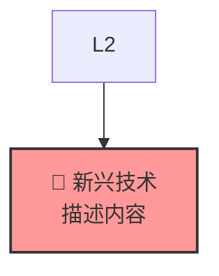

# Web3.0 生态业务架构 - 编辑指南

## 📋 文件清单

本项目包含以下文件格式，满足不同使用需求：

### 1. 思维导图文件
- **文件名**: `Web3_Ecosystem_Architecture.xmind`
- **格式**: XMind思维导图格式
- **用途**: 可直接在XMind软件中打开、编辑和演示
- **特点**: 分层结构清晰，支持折叠展开，便于导航

### 2. 麦肯锡风格架构图
- **文件名**: `Web3_Architecture_McKinsey_Style.md`
- **格式**: Markdown + Mermaid图表
- **用途**: 专业商业演示和文档
- **特点**: 麦肯锡咨询风格，支持多种图表类型

### 3. PNG图像文件
- **主架构图**: `Web3_Architecture.png`
- **市场分析图**: `Web3_Market_Analysis.png`
- **用途**: 直接插入PPT、报告或网页
- **特点**: 高分辨率（300 DPI），专业配色

### 4. 生成脚本
- **文件名**: `generate_architecture_png.py`
- **用途**: 自定义生成PNG图表
- **特点**: 可修改颜色、布局、内容

---

## 🛠️ 编辑方法详解

### XMind文件编辑

#### 安装XMind软件
```bash
# macOS
brew install --cask xmind

# Windows: 下载安装包
# https://www.xmind.net/download/

# Linux
sudo snap install xmind-2020
```

#### 编辑步骤
1. **打开文件**: 双击`Web3_Ecosystem_Architecture.xmind`
2. **编辑内容**:
   - 点击任意节点进行文字编辑
   - 右键添加子节点或同级节点
   - 拖拽调整节点位置
3. **修改样式**:
   - 选中节点 → 右侧属性面板 → 修改颜色、字体
   - 更改主题: 菜单栏 → 格式 → 主题
4. **添加图标**: 选中节点 → 插入 → 图标
5. **保存**: Ctrl+S (Windows/Linux) 或 Cmd+S (macOS)

#### 推荐编辑操作
- **添加新技术**: 在相应层级下添加子节点
- **标记重要性**: 使用⭐符号或改变节点颜色
- **添加说明**: 使用备注功能（右键 → 备注）

### Mermaid图表编辑

#### 支持的编辑器
- **在线编辑**: https://mermaid.live/
- **VS Code**: 安装Mermaid Preview扩展
- **Typora**: 原生支持Mermaid
- **GitHub**: 直接渲染Mermaid代码

#### 编辑语法示例


#### 修改颜色主题
```mermaid
%% 在图表开头定义新的样式类
classDef coretech fill:#your-color,stroke:#border-color,stroke-width:4px,color:#text-color
```

### Python脚本自定义

#### 修改颜色方案
```python
# 在generate_architecture_png.py中找到colors字典
colors = {
    'L0': '#your-new-color',  # 修改为你想要的颜色
    'L1': '#another-color',
    # ... 其他颜色
}
```

#### 添加新的层级或组件
```python
# 在layers列表中添加新项目
{
    'name': 'L6: 新层级名称',
    'subtitle': '层级描述',
    'y': 12,  # Y坐标位置
    'height': 1.5,
    'color': colors['L6'],  # 需要先在colors中定义
    'components': [
        '🆕 新组件1 (相关项目)',
        '🔥 新组件2 ⭐ (核心技术)'
    ]
}
```

#### 运行修改后的脚本
```bash
cd /workspace
python3 generate_architecture_png.py
```

---

## 🎨 设计原则与规范

### 颜色编码系统
- **🔴 L0 (深蓝 #1e3a8a)**: 基础设施，稳定可靠
- **🟢 L1 (绿色 #059669)**: 区块链核心，生态基石
- **🔴 L2 (红色 #dc2626)**: 中间件，连接桥梁
- **🟠 L3 (橙色 #7c2d12)**: 金融组件，价值流动
- **🟣 L4 (紫色 #581c87)**: 应用场景，用户体验
- **🩷 L5 (粉色 #be185d)**: 用户接入，合规门户
- **🟡 核心技术 (黄色 #fbbf24)**: 关键技术高亮

### 图标使用规范
- **🔐**: 安全相关（钱包、加密）
- **⚡**: 高性能技术（Solana、L2）
- **🌉**: 连接技术（跨链、桥接）
- **💎**: 价值存储（比特币、稳定币）
- **🏛️**: 基础设施（以太坊、公链）
- **⭐**: 核心关键技术标识

### 文字规范
- **中英文混合**: 技术名称保留英文，说明使用中文
- **层级标识**: 统一使用L0-L5格式
- **重要性标记**: 核心技术添加⭐符号
- **市场主体**: 括号内标注具体项目/公司名称

---

## 📊 内容更新指南

### 技术评估维度
1. **使用范围**: 生态系统采用的广度和深度
2. **技术先进性**: 创新程度、性能指标、解决问题的能力
3. **共识程度**: 行业认可度、标准化程度、开发者支持
4. **未来潜力**: 发展前景、投资价值、增长预期

### 添加新技术的步骤
1. **评估重要性**: 根据上述四个维度评分
2. **确定层级**: 判断属于哪个技术层级
3. **标记核心**: 如果是关键技术，添加⭐标识
4. **更新所有格式**: 同步更新XMind、Mermaid、Python脚本

### 市场主体更新
- **定期审查**: 每季度更新一次主要项目和公司
- **融资事件**: 关注重大融资，可能影响市场地位
- **技术突破**: 关注技术创新，可能改变竞争格局
- **监管变化**: 关注政策变化对不同主体的影响

---

## 🔧 技术要求

### 软件依赖
- **XMind**: 8.0+版本
- **Python**: 3.7+版本
- **依赖包**: matplotlib, numpy (已安装)

### 系统要求
- **内存**: 至少2GB可用内存
- **存储**: 100MB可用空间
- **网络**: 在线编辑器需要网络连接

### 导出格式支持
- **XMind**: PNG, PDF, SVG, Word, PowerPoint
- **Mermaid**: PNG, SVG, PDF
- **Python**: PNG, PDF, SVG, EPS

---

## 💡 使用建议

### 演示场景
- **投资者路演**: 使用麦肯锡风格图表
- **技术分享**: 使用XMind思维导图
- **报告插图**: 使用高分辨率PNG图像
- **在线文档**: 使用Mermaid格式

### 定制化建议
1. **根据受众调整**: 技术人员vs商业人员
2. **突出重点**: 根据讨论主题高亮相关部分
3. **简化复杂度**: 必要时隐藏细节，突出核心
4. **保持更新**: 定期更新技术发展和市场变化

### 最佳实践
- **版本控制**: 保留历史版本，便于对比变化
- **备注说明**: 重要修改添加时间戳和说明
- **团队协作**: 建立统一的编辑规范
- **质量检查**: 定期检查内容准确性和时效性

---

## 📞 技术支持

如需进一步的技术支持或定制化需求，可以：
1. 查阅各软件官方文档
2. 参考Web3.0行业报告
3. 关注技术社区动态
4. 咨询专业的区块链分析师

---

**更新日期**: 2025年9月15日  
**版本**: v1.0  
**维护者**: AI Assistant