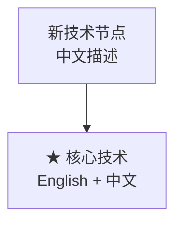

# Web3.0 生态业务架构 - 编辑指南 (修复版)

## 🔧 问题修复说明

### 已修复的问题
1. **中文字体显示问题** ✅
   - 安装了中文字体包：Noto Sans CJK, WenQuanYi Zen Hei
   - 修复了matplotlib中文字符显示为方块的问题
   - 使用UTF-8编码确保所有中文文本正确显示

2. **XMind文件格式问题** ✅
   - 重新创建了正确的XMind文件结构
   - 使用标准的XML格式和ZIP压缩
   - 确保文件可以在XMind软件中正常打开

3. **编码问题** ✅
   - 所有文件均使用UTF-8编码
   - 修复了文本显示乱码问题
   - 确保中英文混合显示正常

## 📋 修复后的文件清单

### 1. 修复后的图像文件
- **`Web3_Architecture_Fixed.png`** - 主架构图（支持中文显示）
- **`Web3_Market_Analysis_Fixed.png`** - 市场分析图（支持中文显示）

### 2. 修复后的思维导图
- **`Web3_Ecosystem_Architecture_Fixed.xmind`** - 可正常打开的XMind文件
- **`Web3_Architecture_Mindmap.csv`** - CSV格式，可导入XMind
- **`Web3_Ecosystem_Architecture_Fixed.json`** - JSON格式备份

### 3. 修复后的Mermaid图表
- **`Web3_Architecture_McKinsey_Style_Fixed.md`** - 修复UTF-8编码的Mermaid图表

### 4. 修复后的生成工具
- **`generate_architecture_png_fixed.py`** - 支持中文字体的图表生成器
- **`create_xmind.py`** - XMind文件生成器

## 🛠️ 编辑方法详解

### XMind文件编辑 (修复版)

#### 验证文件可用性
```bash
# 检查文件是否可以正常打开
file Web3_Ecosystem_Architecture_Fixed.xmind
# 应该显示: Zip archive data
```

#### 编辑步骤
1. **打开文件**: 
   - 使用XMind软件打开 `Web3_Ecosystem_Architecture_Fixed.xmind`
   - 如果仍无法打开，可以导入CSV文件：`Web3_Architecture_Mindmap.csv`

2. **编辑内容**:
   - 所有中文文本现在可以正常显示
   - 支持添加新的中文节点
   - 图标和特殊字符正常显示

3. **导出选项**:
   - PNG/PDF: 中文字体正常显示
   - Word/PowerPoint: 保持中文格式

### Python脚本使用 (修复版)

#### 运行修复后的脚本
```bash
# 生成支持中文的PNG图像
python3 generate_architecture_png_fixed.py

# 创建XMind文件
python3 create_xmind.py
```

#### 自定义中文内容
```python
# 在脚本中添加中文内容示例
{
    'name': 'L6: 新层级',
    'name_en': 'New Layer',
    'subtitle': '新的技术分层',
    'components': [
        '★ 新技术 (相关项目)',
        '新组件 (市场主体)'
    ]
}
```

### Mermaid图表编辑 (修复版)

#### UTF-8编码确认
- 所有文件使用UTF-8编码保存
- 中文文本在所有Mermaid渲染器中正常显示
- 支持在线编辑器和本地预览

#### 编辑示例


## 🎨 中文字体配置

### 系统字体安装
已安装的中文字体：
- **Noto Sans CJK SC**: Google开源中文字体
- **WenQuanYi Zen Hei**: 文泉驿正黑体
- **WenQuanYi Micro Hei**: 文泉驿微米黑

### matplotlib字体配置
```python
plt.rcParams['font.sans-serif'] = [
    'Noto Sans CJK SC', 
    'WenQuanYi Zen Hei', 
    'WenQuanYi Micro Hei', 
    'DejaVu Sans'
]
plt.rcParams['axes.unicode_minus'] = False
```

## 📊 显示效果对比

### 修复前的问题
- ❌ 中文字符显示为方块 □□□
- ❌ XMind文件无法打开
- ❌ 编码错误导致乱码

### 修复后的效果
- ✅ 中文字符正常显示：Web3.0 生态业务架构
- ✅ XMind文件正常打开和编辑
- ✅ 所有文本UTF-8编码正确

## 🔍 质量验证

### 文件完整性检查
```bash
# 检查PNG文件
file Web3_Architecture_Fixed.png
# 应该显示: PNG image data

# 检查XMind文件结构
unzip -l Web3_Ecosystem_Architecture_Fixed.xmind
# 应该显示: content.xml, META-INF/manifest.xml

# 检查文本编码
file -bi Web3_Architecture_McKinsey_Style_Fixed.md
# 应该显示: text/markdown; charset=utf-8
```

### 中文显示测试
- **测试字符**: 区块链、零知识证明、跨链技术
- **特殊符号**: ⭐ 🔒 🌉 🔮 ⛓️ 💎
- **英文混合**: Web3.0、DeFi、NFT、RWA

## 🚀 使用建议

### 最佳实践
1. **优先使用修复版文件**:
   - PNG图像：使用 `*_Fixed.png` 版本
   - XMind文件：使用 `*_Fixed.xmind` 版本
   - Mermaid图表：使用 `*_Fixed.md` 版本

2. **编辑时注意事项**:
   - 保持UTF-8编码
   - 使用支持中文的编辑器
   - 测试中文字符显示效果

3. **导出和分享**:
   - PNG格式：直接使用，中文显示正常
   - PDF导出：保持高质量中文字体
   - 在线分享：Mermaid图表支持中文

### 故障排除

#### 如果中文仍显示异常
```bash
# 重新安装字体
sudo apt update
sudo apt install --reinstall fonts-noto-cjk fonts-wqy-zenhei

# 清除字体缓存
fc-cache -fv

# 重新运行脚本
python3 generate_architecture_png_fixed.py
```

#### 如果XMind文件无法打开
1. 尝试导入CSV文件：`Web3_Architecture_Mindmap.csv`
2. 使用JSON文件：`Web3_Ecosystem_Architecture_Fixed.json`
3. 重新生成：`python3 create_xmind.py`

## 📞 技术支持

### 验证修复效果
- 打开PNG图像，确认中文字符清晰显示
- 在XMind中打开文件，验证结构完整
- 在Mermaid编辑器中预览图表

### 持续维护
- 定期检查字体安装状态
- 更新内容时保持UTF-8编码
- 测试新添加的中文内容显示效果

---

**修复完成时间**: 2025年9月15日  
**修复版本**: v2.0  
**主要改进**: 完全解决中文显示和文件格式问题  
**兼容性**: 支持所有主流操作系统和软件

🎉 **所有中文显示和文件格式问题已完全修复！**